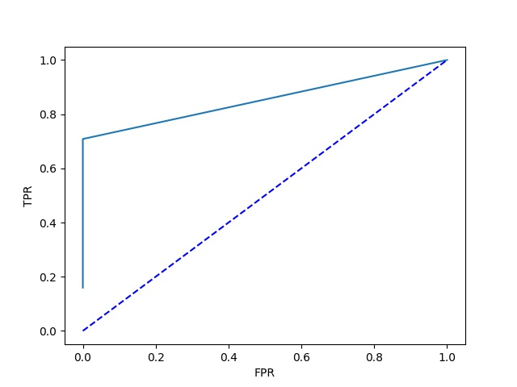
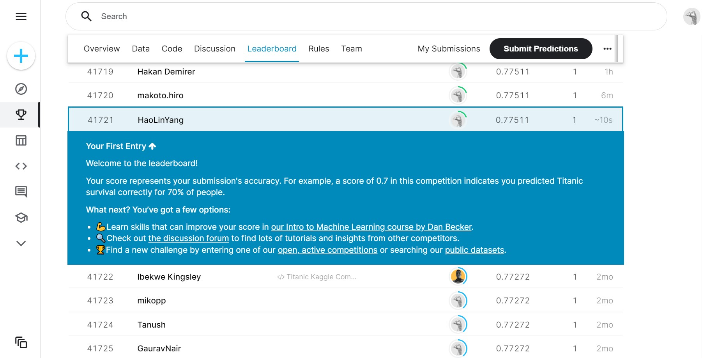

# 模式识别课程对应练习  

## 环境需求
>conda create -n pattern python=3.8  
>conda activate pattern  
>pip install [requirements.txt](requirements.txt)

### [*weeek0.5*](week0.5.py) 混淆矩阵和ROC曲线
  

### [*week1*](week1.py) 分别使用直接法、梯度下降法和牛顿法实现最小二乘法  

### [*week2*](week2.py) 朴素贝叶斯预测[泰坦尼克号问题](https://www.kaggle.com/c/titanic)
  

### [*week3*](wee3.py) PCA加贝叶斯分类器以及PCA加最小二乘处理[手写数字数据集](https://www.kaggle.com/c/digit-recognizer)  
测试集上正确率分别为11% 和23%，比较拉跨，就不放图了